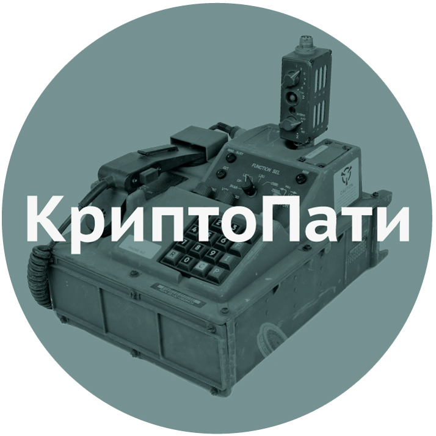

## 3 декабря 2015, 18:00, Дубна, ул. Блохинцева, д. 13

[Афиша](CryptoParty_2015_A3.pdf)

### КриптоПати им. Аарона Шварца
Начало 18:00 коворкинг Нейтрино – ул. Блохинцева, д. 13 (в здании библиотеки "Блохинка"). Проводится совместно с ОМУС ОИЯИ. 

### Докладчики: Александр 4ept, Иван Маркин, Михаил Ширков

###18:00 – 18:45 Михаил Ширков: block chain революция
В настоящее время block chain используется повсеместно, начиная с криптовалют и заканчивая умными контрактами и приватными мессенджерами. Вы узнаете о том, как это работает изнутри и как может быть полезно в науке и повседневной жизни.    

###18:50 - 19:35 Александр 4ept:  построение mesh сетей на базе cjdns; hyperboria
Есть ли будущее у современного интернета? Выживаема ли идея Tim Berners-Lee в сегодняшних реалиях? Александр расскажет о том, как работает cjdns и hyperboria и покажет, как это применяется на реальном оборудовании. 

###19:40 - 20:25 Иван Маркин: GPG TOR OTR WTF. Основные инструменты обеспечения приватности
Как вижить в суровых реалиях пост-Сноуденовской эры? Иван
расскажет про основные проблемы, которые поджидают пользователей информационных систем, и как их решать, не будучи шпионом или агентом 007.

Мы научимся защищать
* почтовую переписку и файлы с помощью шифрования PGP
* чаты и мгновенные сообщения с помощью OTR
* личность и метаданные в Интренете с помощью Tor

